<p align="center">
  <h1 align="center">A Simple Search System</h1>
  <p align="center">with Python</p>
</p> 


[](/LICENSE) 


### Keyword
> `TF-IDF` `Information Retrieval` 


## Contents 
<!-- toc -->
* [Introduction](#introduction)
* [Release](#release)
* [Environment](#environment)
* [Author](#author)
* [Installation](#installation)
* [User Manual](#user-manual)
* [Documentation](#documentation)
* [Development Introduction](#development-introduction)
* [Contact](#contact)
* [License](#license)

<!-- toc stop -->


## Introduction

The project is an inverted index for a set of documents, and then the inverted index is used to implement quick search for various kinds of query. The input of the program is a large collection of English documents. 

### Project Requirement

#### Basic
- Use the Inverted Index approach to implement a simple Index and Query system for the given document set.
- The system is able to search the relevant documents for a single term query, such as., “movie” or “retrieval”.
- Write an interface for the program which is able to
	- Let users input the document directory for indexing;
	- Let users input the query they want to search;
	- Display the names of the retrieved documents for users.

#### Advanced 
- The system is able to search the relevant documents for a composite query consisting of two or more words connected by “OR” or “AND”, e.g., “movie” AND “retrieval”; “movie” OR “TV”, etc. The composite query using both “AND” and “OR”, like (“action” OR “comedy”) AND “movie”,.is NOT required, 
- The system is able to search the relevant documents for a phrase query consisting of two or more words, like “good movie”.

#### Superior
- The system is able to rank the relevant documents according to their relevance to the query (for example, by Vector Space Model) and display the documents according to the ranking results.
- Develop a better interface for your program. For example, it can display the content of the retrieved documents to users. The words in the query should be highlighted.
- Any other functions which may improve the indexing/searching quality. 


## Release
- [SearchSystem GUI Version](https://github.com/Cqyhid/SearchSystem/releases) 


## Environment
- Python: 3.6.5 (also work with python 2) <br>
- Windows OS <br>


## Author
- [Key](https://github.com/tavik000) <br>
- [Chen Qi](https://github.com/Cqyhid) <br>


## Installation

### For CLI Version

#### 1.1 Download the Program
```bash
git clone git@github.com:Cqyhid/SearchSystem.git
```

#### 1.2 Change directory
```bash
$ cd QueryIndex\CLI
```
#### 1.3 Run the program
```bash
$ python main.py
```

### For GUI Version

#### 2.1 Run the .exe program from your computer directly
[Download from Release](#release)

#### 2.2.1 Download the Program (If you want to run the python program locally)
```bash
git clone git@github.com:Cqyhid/SearchSystem.git
```

#### 2.2.2 Change directory
```bash
$ cd QueryIndex\GUI
```

#### 2.2.3 Install Kivy Package 

Follow [Kivy's Document](https://kivy.org/doc/stable/installation/installation.html#installation-devel) for installation

#### 2.2.4 Run the program

```bash
$ python kivy_main.py
```

## User Manual

### For CLI Version

#### 1.1 Run the program 
```bash
$ python main.py
```

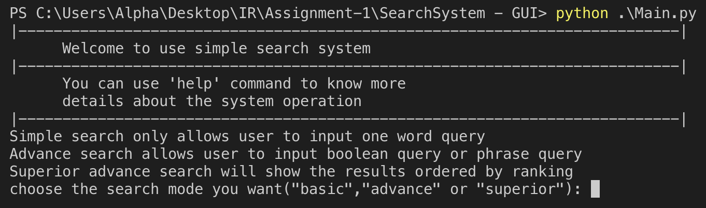 <br>

#### 1.2 Select Searching Mode 
```bash
$ basic
```

or 

```bash
$ advance
```

or 

```bash
$ superior
```


#### 1.3.1.1 Basic Mode Instruction 
Type your Documents's path

```bash
$ C:\Users\Alpha\Desktop\IR\Assignment-1\data\data
```

 <br>

And wait until `Sorting completed!` is displayed.

#### 1.3.1.2 Basic Mode Instruction 
Type `query` to search

```bash
$ query
```

#### 1.3.1.3 Basic Mode Instruction 
Input the query

For Example

```bash
$ Indians
```

#### 1.3.1.4 Basic Mode Instruction 
Check the results

Relative documents and term's occur time would be display.

For Example

{'D0601.M.250.A.A': 2, 'D0601.M.250.A.E': 2, 'D0601.M.250.A.C': 6, 'D0614.M.250.E.B': 1, 'D0601.M.250.A.B': 4}

Document name "D0601.M.250.A.A" have the term 'indians' two times.


#### 1.3.1.5 Basic Mode Instruction 
Terminate the program by typing 

```bash
$ exit
```


#### 1.3.2.1 Advance Mode Instruction 

Type your Documents's path

```bash
$ C:\Users\Alpha\Desktop\IR\Assignment-1\data\data
```

And wait until `Sorting completed!` is displayed.

#### 1.3.2.2 Advance Mode Instruction 

Type `query` to search

```bash
$ query
```

#### 1.3.2.3 Advance Mode Instruction 

Select phrase search or boolean search

```bash
$ phrase
```

or

```bash
$ boolean
```

#### 1.3.2.4.1.1 Advance Mode Instruction (Phrase Search) 

Type the query

For Example

```bash
$ indians comprise
```

or

```bash
$ indians comprise less
```

#### 1.3.2.4.1.2 Advance Mode Instruction (Phrase Search) 

Check the results

For Exmaple

The results of the query is:

`['D0601.M.250.A.A']`


#### 1.3.2.4.1.3 Advance Mode Instruction (Phrase Search) 

Terminate the program by typing 

```bash
$ exit
```

#### 1.3.2.4.2.1 Advance Mode Instruction (Boolean Search) 

Type the query

For Example

```bash
$ indians and less
```

or

```bash
$ indians or less
```

#### 1.3.2.4.2.2 Advance Mode Instruction (Boolean Search) 

Check the results

#### 1.3.2.4.2.3 Advance Mode Instruction (Boolean Search) 

Terminate the program by typing 

```bash
$ exit
```

#### 1.3.3.1 Superior Mode Instruction 

Type your Documents's path

```bash
$ C:\Users\Alpha\Desktop\IR\Assignment-1\data\data
```

And wait until `Sorting completed!` is displayed.


#### 1.3.3.2 Superior Mode Instruction 

Type `query` to search

```bash
$ query
```

#### 1.3.3.3 Superior Mode Instruction 

Type the query

For Example

```bash
$ indians less comprise
```

#### 1.3.3.4 Superior Mode Instruction 

Check the results

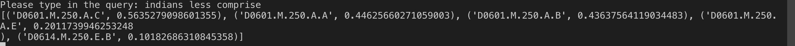 <br>

For Example
('D0601.M.250.A.C', 0.5635279098601355)

Means that document `D0601.M.250.A.C` with the score 0.563 for the query `indians less comprise`
<br><br>
The higher score indicates a better matched with the documents.


#### 1.3.3.5 Superior Mode Instruction 

Terminate the program by typing 

```bash
$ exit
```


### For GUI Version

#### 2.1 Download the GUI program
[Download from Release](#release)

#### 2.2 Run the .exe program from your computer directly

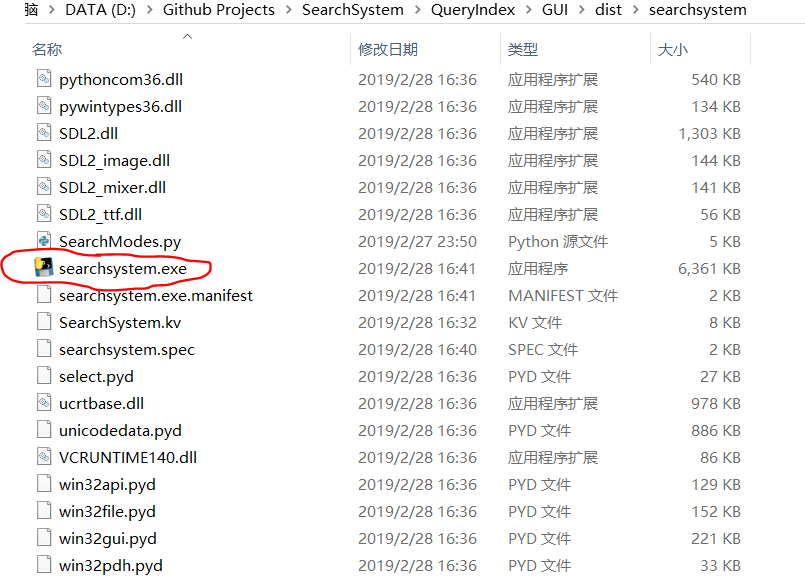 <br>

#### 2.3 Choose Search Mode

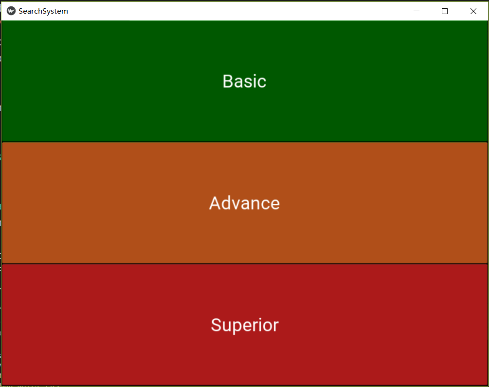 <br>

#### 2.4 Choose directory of documents

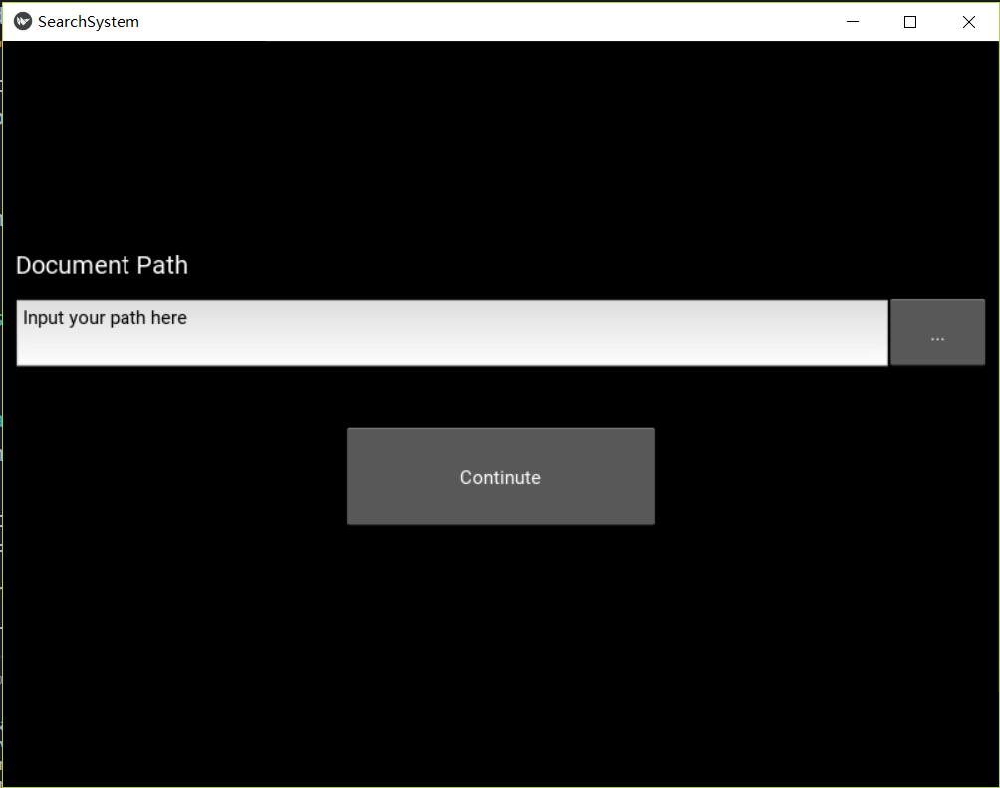 <br>

**File Chooser might malfunction for now, better to input your path manually**
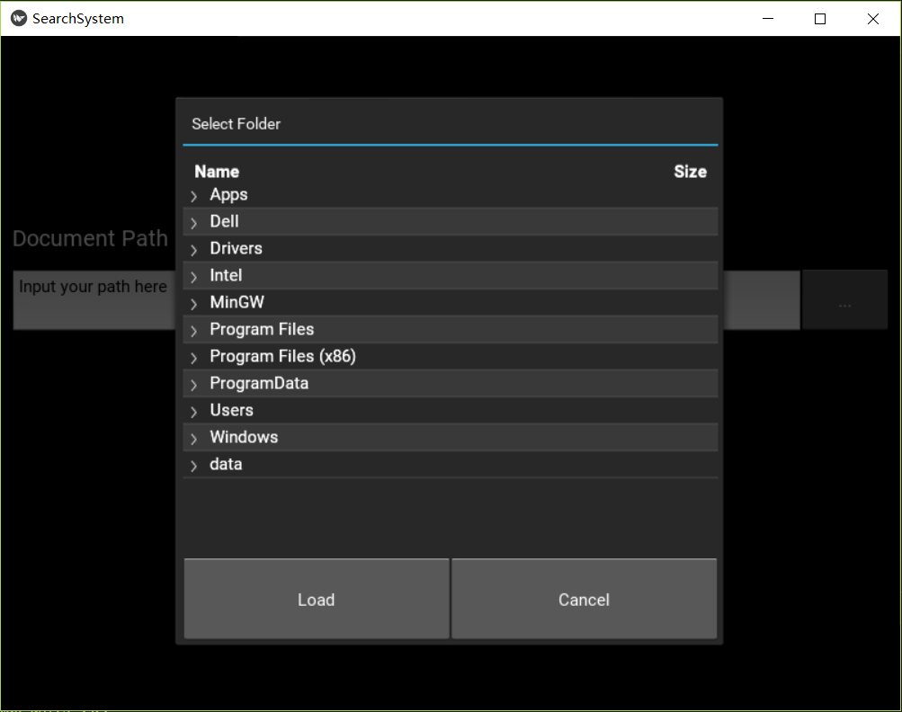 <br>

#### 2.5.1.1 Basic Query

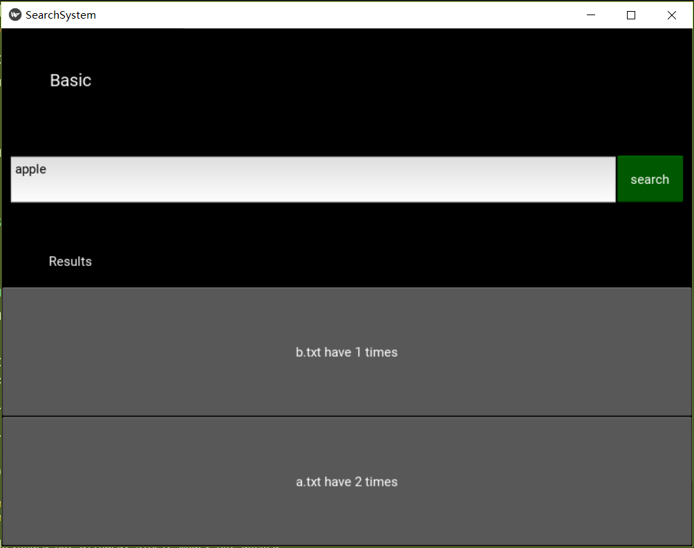 <br>

#### 2.5.1.2 Check detail of result

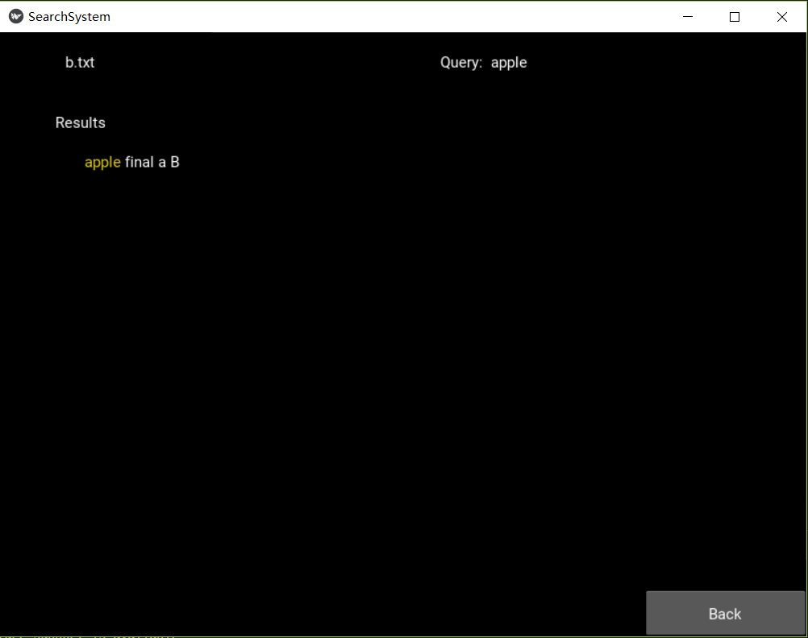 <br>

#### 2.5.2.1 Advance Search Mode Option

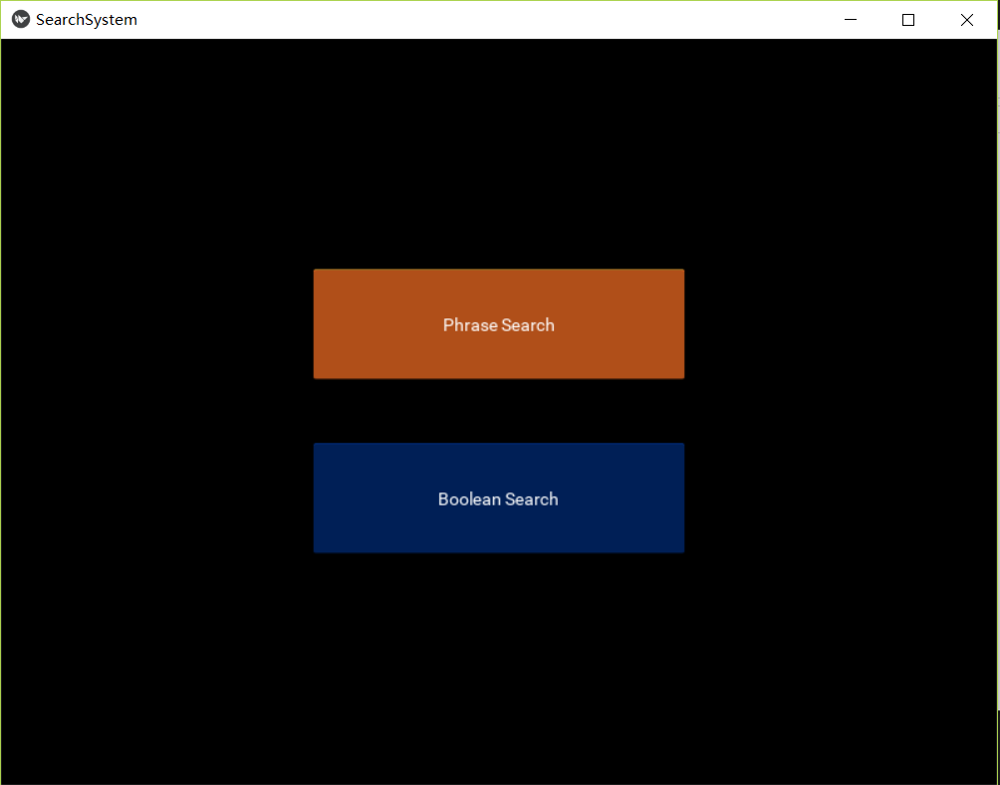 <br>

#### 2.5.2.2.1.1 Advance Query (Phrash Search)

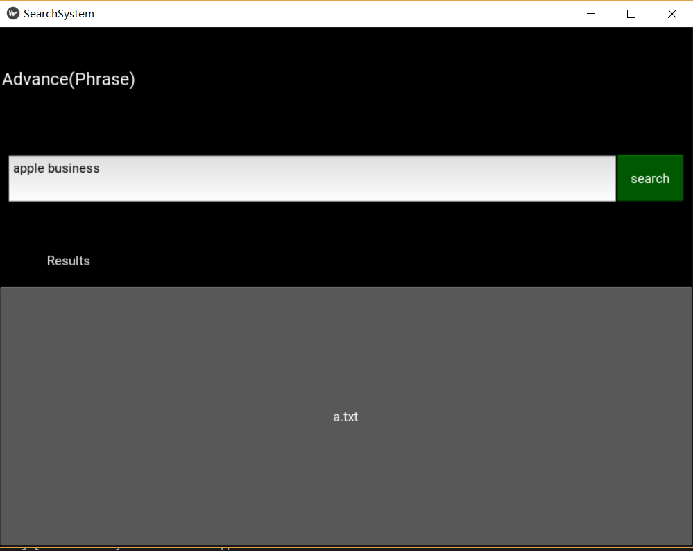 <br>

#### 2.5.2.2.1.2 Check detail of result

 <br>

#### 2.5.2.2.2.1 Advance Query (Boolean Search)

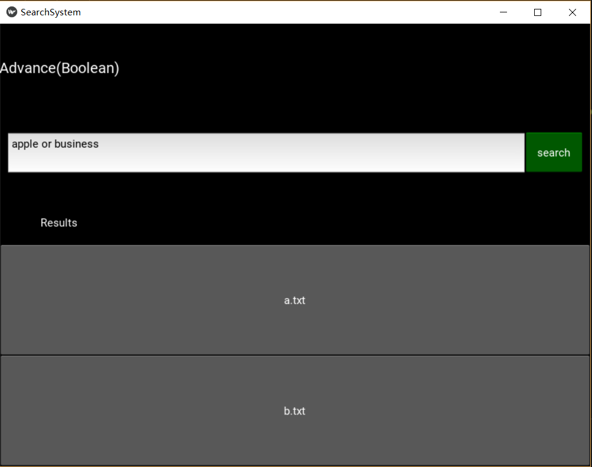 <br>

or <br>

 <br>

#### 2.5.2.2.2.2 Check detail of result

 <br>

#### 2.5.3.1 Superior Query

 <br>

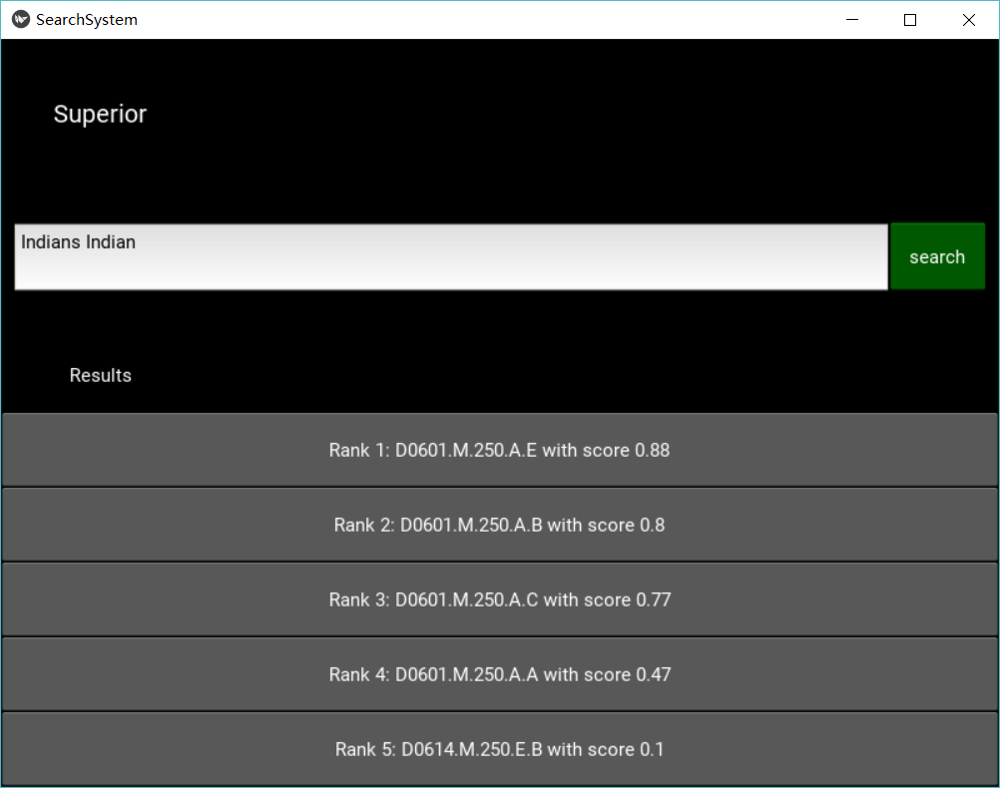 <br>

#### 2.5.3.2 Check detail of result

 <br>


## Documentation


### Functions of the program

#### Main.py

Continutly detecting user’s input and handle error inputs. And call different functions for different input corresponded.

#### FileReading.py

fileReading(file_path):
Read files from the directory of basic search. It stores all the term of documents into an inverted index. Convert all word into lowercase.
A stop word list is used to delete the common words in all files. The file name and the term appear in each typical file with its times would be stored in a nested dictionary.
This function returns a dictionary with {term:file} pairs. The repetitive file name is recorded which allows the program to calculate the times that one term appears in a file.
This function also returns a dictionary contains the position information of each word. It returns a dictionary with {file:[]} pairs. The array in value store the words in the file in order. The program can, therefore, access to the position of each word.

termVectorFileReading(file_path):
Read files from the directory of vector search. It searches the directory which inputs by the user and opens all the non-directory files. The string lines inside the file will be stored and broke into an array by a blank. The array is composited with words appear in the file. A stop word list is also applied.
The nested dictionary is composited with {term : times} pairs while the out layer is the {file : {term:times}} pairs.
The times will then be transformed into normalization format by using the vector space model. The Euclidean weights are applied in this function.

#### Function.py

IDF(document_frequency,total_document_number):
Calculate the IDF using the formula of log10(N/df)

#### Interface.py

init(self):
Display the command line interface of main menu to user.

do_query_simple(self,file_collection):
Get the query of user input of command line.

do_query_boolean(self,file_collection):
Get the query of user input of command line of using Boolean searching.

do_query_multiwords(self,file_collection,position_information):
Get the query of user input of command line of using Phase searching.

do_query_ranking(self,final_word_list,file_collection,doc_idf):
Get the query of user input of command line of using Vector Space Ranking searching.

do_path_basic(self):
Get the path of documents from user input.

do_path_vector(self):
Get the path of documents from user input when using vector space searching.

display_results(self,data):
Display the searching’s results.

search_mode(self):
Get the searching’s mode of user input. For user to select the searching’s mode.

do_help(self):
Display the command line instruction to users.

SearchModes.py
simpleSearch(query,inverted_index):
Using an inverted index to get the results of the query using the index of the dictionary in python. Return the results together with the counted number to the command line interface.

booleanSearch(query,inverted_index):
Check the user input of keyword ‘and’ or ‘or’ first. Separate the query term and store in a query’s list. For ‘AND’ search, check all the query’s term in the inverted index vector. Then delete the document’s result when it was not contained in the later query’s term. For ‘OR’ search, add all the document occur in the for loop searching. 

multiwordsSearch(query,totalInfo):
Get the query list and find out the results of the first query using the inverted index of the dictionary in python. The inverted index and position information are packed in the object totalInfo. Then, check if the next word in the query list is the same as the next word in position information array. If not, delete the file in the final list.

rankingSearch(query,final_word_list,totalInfo):
The query, final word list, normalized vector, and IDF information are used in this function.  The function will turn the query into a vector then use the IDF information to transform the query vector into a normalized vector. Then do the cosine similarity between the normalized query vector and every normalized file term vectors. Store the file name and ranking points in a dictionary as a {name: value} pair. Use the sorted function in python to rank the file name then return the results.


## Development Introduction

### Basic Requirement
	
We developed the basic one first. We wrote a program for a command line interface that allowed the user to type the command in the program. For the first requirement (Use the Inverted Index approach to implement a simple Index and Query system for the given document set.) We wrote the program to read all documents in the directory. Also, allow the user to indicate the path of the directory. All words in English are separated with a space character. So we found all the space character and store the word in the inverted index vector. Also, count the number of occurrence of the term in the document. The vector of the term indicated which document contained the word and the number of terms. In Python, we use the dictionary. Which is contain key and value pair. In this case, the key is the term. The value is the vector of the document. For example, {“apple”:[“doc1”, ”doc2”]}. After that, the searching is to put the user’s input into the vector of the inverted index. The dictionary could get the correspond key-value pair of the term. For example, query = “apple”, then inverted_index[query] would return the value [“doc1”,”doc2”]. Up to now, all Basic Requirements were fulfilled.

### Advanced Requirements
For the Boolean search, we decided to implement a program that first detected the “AND” searching or “OR” searching, then stored all the query’s term in a vector. For the “AND” search. We use a for loop function to check all the query’s term in the inverted index vector. Then delete the document’s result when it was not contained in the later query’s term. For example, the query is “Alice AND Bob” then the Alice result is [“doc1”, ”doc2”], and Bob result is [“doc1”], at that time, doc2 of the final result would be deleted. For the “OR” search. We just add all the document occur in the for loop searching. 

For the phrase query’s searching. We store the term of in document in a vector that it also contains the position’s index. When processing the phrase query, we check the second’s term of the query is the next term (index + 1) of the first term or not. If it didn't then remove the document from the result.	
	
### Superior Advanced Requirements

We had removed the stop word from documents. And transform all the term to lower case. Also, apply that to query.

For the requirement of ranking search. We use the vector space model to implement the TF-IDF and the cosine similarity. First, we did not use the same way of indexing in the basic version. We read all the document to make a term collection for the calculation of Document Frequency later. And store the total number of documents too. Then, we used a nested dictionary to store the Term Frequency of different documents. Then we created a Document frequency. We create a dictionary to store the document frequency of each term. The program read all the document to count the number of each term’s appearance. Then we use TF and df to calculate IDF by implemented the formula in the program. Then use TF and IDF to calculate TF-IDF weight. And also calculate the length of each document and do the normalization of the weight. For the query function, we pass the IDF to the searching program for calculating the weight of the query. Then we construct a dictionary of the query which is the term frequency in the same way. And calculate the weight by multiplied TF with IDF. And compute the cosine similarity by multiplied normalized weight of document with query’s weight. Use this as a score to store in the dictionary. Then the dictionary showed all the score of the document for this query. Sorted by descended and 0 scores of documented were removed. Then return the result to the user. The result showed the document with the score.


For improve the indexing and searching quality, we use Hashtable in Python for both indexing and searching. The dictionary component in Python is using the data structure of Hashtable.

GUI, In this project, the python GUI was also developed by using kivy API. Users can choose the different mode in the kivy interface. When user click the button, the screen will jump to path input screen. User needs to type in the absolute path of the directory. If the path is incorrect, the system will inform user the error messages. After the sorting completed, the screen will jump to query interface where user can type in the query they want. If they choose the advance mode, they need to specify Boolean or Phrase search first before entering the query interface. In the query interface, the results will be displayed in the bottom of the screen as buttons. User can check the detail information of the return results by clicking the button with the document name they want. The screen will then display the full content of the file with the highlighted key query words.
		The GUI search system used the logic in basic, advance and superior search system. The file reading and search logic has no changed. The basic mode only allows one-word query and the Boolean mode cannot search “AND” and “OR” simultaneously. Besides, the superior mode will display the score of each return file, the user can therefore choose the one with higher rank.


<br>


**If you like this, please leave a star.**

-----


## Contact


Email:  Peter <chenqi1123344@gmail.com>

Email:  Key <tavik002@gmail.com>


-----
## License
MIT License

Copyright (c) 2019 key

Permission is hereby granted, free of charge, to any person obtaining a copy
of this software and associated documentation files (the "Software"), to deal
in the Software without restriction, including without limitation the rights
to use, copy, modify, merge, publish, distribute, sublicense, and/or sell
copies of the Software, and to permit persons to whom the Software is
furnished to do so, subject to the following conditions:

The above copyright notice and this permission notice shall be included in all
copies or substantial portions of the Software.

THE SOFTWARE IS PROVIDED "AS IS", WITHOUT WARRANTY OF ANY KIND, EXPRESS OR
IMPLIED, INCLUDING BUT NOT LIMITED TO THE WARRANTIES OF MERCHANTABILITY,
FITNESS FOR A PARTICULAR PURPOSE AND NONINFRINGEMENT. IN NO EVENT SHALL THE
AUTHORS OR COPYRIGHT HOLDERS BE LIABLE FOR ANY CLAIM, DAMAGES OR OTHER
LIABILITY, WHETHER IN AN ACTION OF CONTRACT, TORT OR OTHERWISE, ARISING FROM,
OUT OF OR IN CONNECTION WITH THE SOFTWARE OR THE USE OR OTHER DEALINGS IN THE
SOFTWARE.


[⬆ Back to top](#contents)

**All Copyright Reserved**
